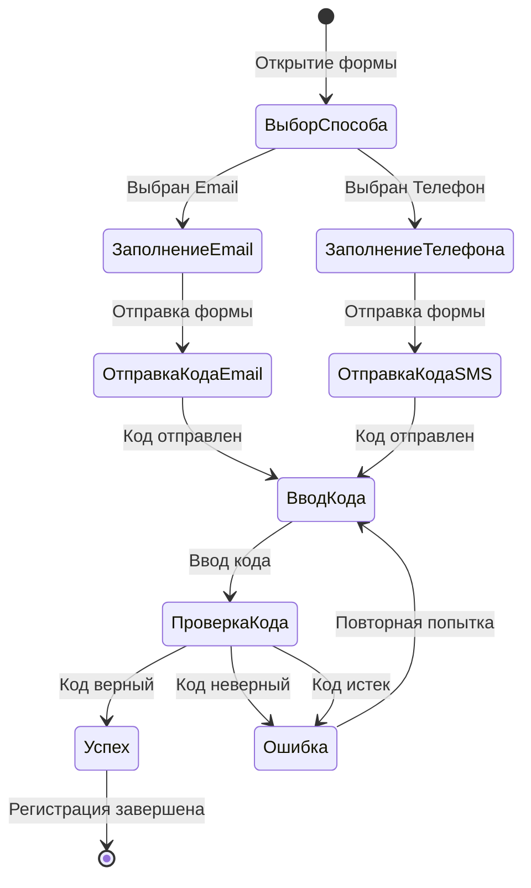

# Документ проектирования: Исправление Google OAuth

## Обзор

Данный документ описывает проектное решение для исправления проблем с Google OAuth авторизацией и добавления функциональности выбора способа подтверждения регистрации в приложении user-portal.

Основные изменения:
1. Удаление кнопки Google OAuth с вкладки "Регистрация"
2. Сохранение кнопки Google OAuth на вкладке "Вход"
3. Добавление выбора способа подтверждения регистрации (email или телефон)
4. Реализация подтверждения регистрации через email с кодом
5. Интеграция существующей логики подтверждения через телефон
6. Обновление документации по настройке Google Client ID

## Архитектура

### Текущая архитектура

Приложение user-portal построено на React с использованием:
- **Blueprint UI** для компонентов интерфейса
- **Zustand** для управления состоянием (authStore)
- **React Router** для навигации
- **Custom hooks** для бизнес-логики (useAuth)

Структура компонентов аутентификации:
```
LoginPage (страница с табами)
├── Tab "Вход"
│   ├── LoginForm
│   └── GoogleAuthButton
└── Tab "Регистрация"
    ├── RegisterForm
    └── GoogleAuthButton (нужно удалить)
```

### Новая архитектура

После изменений структура будет следующей:
```
LoginPage (страница с табами)
├── Tab "Вход"
│   ├── LoginForm
│   └── GoogleAuthButton
└── Tab "Регистрация"
    └── RegisterForm (расширенная)
        ├── RadioGroup (выбор способа подтверждения)
        ├── Условные поля (email ИЛИ телефон)
        └── Поле кода подтверждения (после отправки)
```

### Диаграмма потока регистрации



## Компоненты и интерфейсы

### 1. LoginPage.tsx (изменения)

**Изменения:**
- Удалить блок с `GoogleAuthButton` из панели таба "Регистрация" (строки 130-139)
- Удалить `Divider` перед `GoogleAuthButton` в табе "Регистрация"
- Сохранить `GoogleAuthButton` в табе "Вход" без изменений

**Код для удаления:**
```typescript
{/* Разделитель */}
<Divider style={{ margin: '24px 0' }} />

{/* Кнопка Google авторизации */}
<GoogleAuthButton
  onSuccess={handleAuthSuccess}
  buttonText="Зарегистрироваться через Google"
  fill
  large
/>
```

### 2. RegisterForm.tsx (расширение)

**Новые типы:**
```typescript
/**
 * Способ подтверждения регистрации
 */
type VerificationMethod = 'email' | 'phone';

/**
 * Этап процесса регистрации
 */
type RegistrationStep = 'input' | 'verification';

/**
 * Расширенное состояние формы регистрации
 */
interface RegisterFormState {
  // Существующие поля
  username: string;
  email: string;
  phone: string;
  password: string;
  confirmPassword: string;
  firstName: string;
  lastName: string;
  middleName: string;
  
  // Новые поля
  verificationMethod: VerificationMethod;
  verificationCode: string;
  registrationStep: RegistrationStep;
}
```

**Новые функции:**

1. **handleVerificationMethodChange** - обработчик изменения способа подтверждения
   - Обновляет `verificationMethod` в состоянии
   - Очищает поле email при выборе "phone"
   - Очищает поле phone при выборе "email"

2. **handleSendVerificationCode** - отправка кода подтверждения
   - Валидирует форму
   - Отправляет запрос на сервер для отправки кода
   - Переключает `registrationStep` на 'verification'
   - Для email: вызывает API `/api/v1/auth/send-email-verification`
   - Для phone: использует существующую логику SMS

3. **handleVerifyCode** - проверка кода подтверждения
   - Отправляет код на сервер для проверки
   - При успехе: завершает регистрацию
   - При ошибке: показывает сообщение об ошибке

4. **handleResendCode** - повторная отправка кода
   - Вызывает `handleSendVerificationCode` повторно
   - Показывает уведомление об отправке

**Новые UI элементы:**

1. **RadioGroup для выбора способа подтверждения:**
```typescript
<RadioGroup
  label="Способ подтверждения"
  onChange={handleVerificationMethodChange}
  selectedValue={formData.verificationMethod}
  inline
>
  <Radio label="Подтверждение по email" value="email" />
  <Radio label="Подтверждение по телефону" value="phone" />
</RadioGroup>
```

2. **Условное отображение полей:**
```typescript
{formData.verificationMethod === 'email' && (
  <FormGroup label="Email *" ...>
    <InputGroup ... />
  </FormGroup>
)}

{formData.verificationMethod === 'phone' && (
  <FormGroup label="Телефон *" ...>
    <InputGroup ... />
  </FormGroup>
)}
```

3. **Поле кода подтверждения (показывается после отправки):**
```typescript
{formData.registrationStep === 'verification' && (
  <FormGroup label="Код подтверждения *" ...>
    <InputGroup
      placeholder="Введите код из письма/SMS"
      value={formData.verificationCode}
      onChange={handleInputChange('verificationCode')}
      maxLength={6}
    />
  </FormGroup>
)}
```

### 3. authService.ts (новые методы)

**Новые методы API:**

```typescript
/**
 * Отправка кода подтверждения на email
 */
async sendEmailVerification(email: string): Promise<void> {
  const response = await apiClient.post('/auth/send-email-verification', {
    email
  });
  
  if (!response.ok) {
    throw new Error('Не удалось отправить код подтверждения');
  }
}

/**
 * Проверка кода подтверждения email
 */
async verifyEmailCode(email: string, code: string): Promise<void> {
  const response = await apiClient.post('/auth/verify-email-code', {
    email,
    code
  });
  
  if (!response.ok) {
    throw new Error('Неверный код подтверждения');
  }
}

/**
 * Регистрация с подтверждением email
 */
async registerWithEmailVerification(
  data: RegisterData,
  verificationCode: string
): Promise<void> {
  const response = await apiClient.post('/auth/register-with-email', {
    ...data,
    verificationCode
  });
  
  if (!response.ok) {
    throw new Error('Ошибка регистрации');
  }
  
  // Сохраняем токены и обновляем состояние
  const authData = await response.json();
  this.handleAuthSuccess(authData);
}
```

### 4. useAuth.ts (новые методы)

**Расширение хука:**

```typescript
interface UseAuthReturn {
  // Существующие методы
  isAuthenticated: boolean;
  user: AuthState['user'];
  isLoading: boolean;
  error: string | null;
  login: (credentials: LoginCredentials) => Promise<FieldValidationErrors>;
  register: (data: RegisterData) => Promise<FieldValidationErrors>;
  loginWithGoogle: (idToken: string) => Promise<void>;
  logout: () => Promise<void>;
  clearError: () => void;
  
  // Новые методы
  sendEmailVerification: (email: string) => Promise<void>;
  verifyEmailCode: (email: string, code: string) => Promise<void>;
  registerWithEmailVerification: (
    data: RegisterData,
    verificationCode: string
  ) => Promise<FieldValidationErrors>;
}
```

## Модели данных

### RegisterData (расширение)

```typescript
/**
 * Данные для регистрации пользователя
 */
export interface RegisterData {
  username: string;
  email?: string;  // Опционально (зависит от способа подтверждения)
  phone?: string;  // Опционально (зависит от способа подтверждения)
  password: string;
  confirmPassword: string;
  firstName?: string;
  lastName?: string;
  middleName?: string;
  verificationMethod: 'email' | 'phone';  // Новое поле
}
```

### EmailVerificationRequest

```typescript
/**
 * Запрос на отправку кода подтверждения email
 */
export interface EmailVerificationRequest {
  email: string;
}
```

### EmailVerificationCodeRequest

```typescript
/**
 * Запрос на проверку кода подтверждения email
 */
export interface EmailVerificationCodeRequest {
  email: string;
  code: string;
}
```

### RegisterWithEmailRequest

```typescript
/**
 * Запрос на регистрацию с подтверждением email
 */
export interface RegisterWithEmailRequest extends RegisterData {
  verificationCode: string;
}
```

## Свойства корректности

*Свойство - это характеристика или поведение, которое должно выполняться во всех допустимых выполнениях системы - по сути, формальное утверждение о том, что система должна делать. Свойства служат мостом между человекочитаемыми спецификациями и машинопроверяемыми гарантиями корректности.*


### Свойство 1: Отсутствие Google OAuth на вкладке регистрации
*Для любого* состояния приложения, когда открыта вкладка "Регистрация", GoogleAuthButton и Divider перед ним не должны отображаться в DOM
**Проверяет: Требования 1.1, 1.2**

### Свойство 2: Наличие Google OAuth на вкладке входа
*Для любого* состояния приложения, когда открыта вкладка "Вход", GoogleAuthButton должна отображаться в DOM
**Проверяет: Требования 2.1**

### Свойство 3: Единственный экземпляр GoogleAuthButton
*Для любого* состояния приложения, в дереве компонентов LoginPage должен существовать ровно один экземпляр GoogleAuthButton
**Проверяет: Требования 4.1**

### Свойство 4: Наличие RadioGroup для выбора способа подтверждения
*Для любого* состояния формы регистрации, RadioGroup с опциями "email" и "phone" должен отображаться
**Проверяет: Требования 5.1**

### Свойство 5: Начальное состояние формы
*Для любого* начального состояния формы регистрации, способ подтверждения по умолчанию должен быть "email"
**Проверяет: Требования 5.6**

### Свойство 6: Условное отображение полей при выборе email
*Для любого* состояния формы регистрации, когда выбран способ подтверждения "email", поле email должно отображаться, а поле телефона должно быть скрыто
**Проверяет: Требования 5.2, 5.3**

### Свойство 7: Условное отображение полей при выборе телефона
*Для любого* состояния формы регистрации, когда выбран способ подтверждения "phone", поле телефона должно отображаться, а поле email должно быть скрыто
**Проверяет: Требования 5.4, 5.5**

### Свойство 8: Отправка кода подтверждения email
*Для любого* валидного состояния формы с выбранным "email", при отправке формы должен вызываться API endpoint `/auth/send-email-verification` с правильным email
**Проверяет: Требования 6.1**

### Свойство 9: Переход к вводу кода после отправки
*Для любого* состояния формы, после успешной отправки кода подтверждения, должно отображаться поле "Код подтверждения"
**Проверяет: Требования 6.2**

### Свойство 10: Проверка кода подтверждения
*Для любого* введенного кода подтверждения, при отправке должен вызываться API endpoint `/auth/verify-email-code` с email и кодом
**Проверяет: Требования 6.3**

### Свойство 11: Успешная регистрация при правильном коде
*Для любого* правильного кода подтверждения, при успешном ответе от сервера должен вызываться callback onSuccess
**Проверяет: Требования 6.4**

### Свойство 12: Обработка неверного кода
*Для любого* неверного кода подтверждения, при ошибке от сервера должно отображаться сообщение "Неверный код подтверждения"
**Проверяет: Требования 6.5**

### Свойство 13: Обработка истекшего кода
*Для любого* истекшего кода подтверждения, при ошибке от сервера должно отображаться сообщение об ошибке и кнопка повторной отправки
**Проверяет: Требования 6.7**

### Свойство 14: Использование существующей логики для телефона
*Для любого* валидного состояния формы с выбранным "phone", при отправке формы должна вызываться существующая логика подтверждения по телефону
**Проверяет: Требования 7.1**

## Обработка ошибок

### Ошибки валидации

1. **Пустой email при выборе email-подтверждения**
   - Сообщение: "Email обязателен для заполнения"
   - Действие: Блокировка отправки формы

2. **Невалидный формат email**
   - Сообщение: "Введите корректный email адрес"
   - Действие: Блокировка отправки формы

3. **Пустой телефон при выборе phone-подтверждения**
   - Сообщение: "Телефон обязателен для заполнения"
   - Действие: Блокировка отправки формы

4. **Невалидный формат телефона**
   - Сообщение: "Введите корректный номер телефона (+7XXXXXXXXXX)"
   - Действие: Блокировка отправки формы

### Ошибки отправки кода

1. **Ошибка отправки email**
   - Сообщение: "Не удалось отправить код подтверждения. Попробуйте позже"
   - Действие: Показать Callout с ошибкой, разрешить повторную попытку

2. **Ошибка отправки SMS**
   - Сообщение: "Не удалось отправить SMS. Попробуйте позже"
   - Действие: Показать Callout с ошибкой, разрешить повторную попытку

3. **Превышен лимит отправок**
   - Сообщение: "Превышен лимит отправок кодов. Попробуйте через X минут"
   - Действие: Показать Callout с ошибкой, заблокировать кнопку отправки

### Ошибки проверки кода

1. **Неверный код**
   - Сообщение: "Неверный код подтверждения"
   - Действие: Показать ошибку под полем, разрешить повторный ввод

2. **Истекший код**
   - Сообщение: "Срок действия кода истек. Отправьте код повторно"
   - Действие: Показать Callout с кнопкой "Отправить повторно"

3. **Ошибка сервера при проверке**
   - Сообщение: "Ошибка проверки кода. Попробуйте позже"
   - Действие: Показать Callout с ошибкой

### Ошибки Google OAuth

1. **Google Client ID не настроен**
   - Сообщение: "Google авторизация не настроена. Обратитесь к администратору"
   - Действие: Показать Callout с предупреждением, заблокировать кнопку

2. **Ошибка загрузки Google Identity Services**
   - Сообщение: "Не удалось загрузить Google Identity Services"
   - Действие: Показать Callout с ошибкой, заблокировать кнопку

3. **Ошибка авторизации через Google**
   - Сообщение: "Ошибка авторизации через Google"
   - Действие: Показать Callout с ошибкой, разрешить повторную попытку

## Стратегия тестирования

### Двойной подход к тестированию

Для обеспечения полного покрытия используется комбинация:
- **Unit-тесты**: Проверка конкретных примеров, граничных случаев и условий ошибок
- **Property-based тесты**: Проверка универсальных свойств на множестве входных данных

Оба типа тестов дополняют друг друга и необходимы для комплексного покрытия.

### Unit-тесты

**Баланс unit-тестов:**
- Unit-тесты полезны для конкретных примеров и граничных случаев
- Избегайте написания слишком большого количества unit-тестов - property-based тесты покрывают множество входных данных
- Unit-тесты должны фокусироваться на:
  - Конкретных примерах, демонстрирующих правильное поведение
  - Точках интеграции между компонентами
  - Граничных случаях и условиях ошибок

**Примеры unit-тестов:**

1. **LoginPage.test.tsx**
   - Проверка отсутствия GoogleAuthButton на вкладке "Регистрация"
   - Проверка наличия GoogleAuthButton на вкладке "Вход"
   - Проверка единственного экземпляра GoogleAuthButton

2. **RegisterForm.test.tsx**
   - Проверка начального состояния (email выбран по умолчанию)
   - Проверка переключения между способами подтверждения
   - Проверка условного отображения полей
   - Проверка отправки кода подтверждения
   - Проверка проверки кода
   - Проверка обработки ошибок

3. **authService.test.ts**
   - Проверка вызова правильных API endpoints
   - Проверка обработки ответов сервера
   - Проверка обработки ошибок

### Property-based тесты

**Конфигурация:**
- Библиотека: **fast-check** (для TypeScript/JavaScript)
- Минимум 100 итераций на тест
- Каждый тест должен ссылаться на свойство из документа проектирования
- Формат тега: **Feature: google-oauth-fixes, Property {номер}: {текст свойства}**

**Примеры property-based тестов:**

1. **Свойство 6: Условное отображение полей при выборе email**
```typescript
// Feature: google-oauth-fixes, Property 6: Условное отображение полей при выборе email
fc.assert(
  fc.property(fc.record({
    verificationMethod: fc.constant('email'),
    // ... другие поля формы
  }), (formData) => {
    const { getByLabelText, queryByLabelText } = render(<RegisterForm />);
    // Устанавливаем состояние формы
    // ...
    // Проверяем, что email отображается, а телефон скрыт
    expect(getByLabelText(/email/i)).toBeInTheDocument();
    expect(queryByLabelText(/телефон/i)).not.toBeInTheDocument();
  }),
  { numRuns: 100 }
);
```

2. **Свойство 8: Отправка кода подтверждения email**
```typescript
// Feature: google-oauth-fixes, Property 8: Отправка кода подтверждения email
fc.assert(
  fc.property(
    fc.emailAddress(),
    fc.string({ minLength: 3 }),
    fc.string({ minLength: 8 }),
    (email, username, password) => {
      // Мокируем API
      const mockSendVerification = jest.fn();
      // Рендерим форму
      // Заполняем поля
      // Отправляем форму
      // Проверяем, что вызван правильный API endpoint
      expect(mockSendVerification).toHaveBeenCalledWith({ email });
    }
  ),
  { numRuns: 100 }
);
```

### Интеграционные тесты

1. **Полный flow регистрации с email**
   - Открытие формы → Выбор email → Заполнение → Отправка → Ввод кода → Успех

2. **Полный flow регистрации с телефоном**
   - Открытие формы → Выбор телефона → Заполнение → Отправка → Ввод кода → Успех

3. **Обработка ошибок**
   - Неверный код → Повторная попытка
   - Истекший код → Повторная отправка

### E2E тесты (опционально)

Для критических путей можно добавить E2E тесты с использованием Playwright или Cypress:
1. Регистрация с подтверждением email
2. Регистрация с подтверждением телефона
3. Вход через Google OAuth

## Документация

### README.md (дополнения)

Необходимо добавить секцию о настройке Google OAuth:

```markdown
## Настройка Google OAuth

### Получение Google Client ID

1. Перейдите в [Google Cloud Console](https://console.cloud.google.com/)
2. Создайте новый проект или выберите существующий
3. Перейдите в раздел "APIs & Services" → "Credentials"
4. Нажмите "Create Credentials" → "OAuth client ID"
5. Выберите тип приложения "Web application"
6. Добавьте authorized redirect URIs:
   - `http://localhost:3001` (для разработки)
   - Ваш production URL
7. Скопируйте Client ID

### Настройка переменных окружения

1. Откройте файл `.env`
2. Замените placeholder значение:
   ```
   GOOGLE_CLIENT_ID=your_actual_google_client_id_here
   ```
3. Также обновите `.env.production` для production окружения

⚠️ **Важно**: Без настройки реального Google Client ID авторизация через Google работать не будет. Вы увидите ошибку "The OAuth client was not found".

### Настройка способа подтверждения регистрации

Приложение поддерживает два способа подтверждения регистрации:

1. **Email подтверждение** (по умолчанию)
   - Пользователь получает код на email
   - Вводит код в форме регистрации
   - При успехе получает письмо о завершении регистрации

2. **SMS подтверждение**
   - Пользователь получает код по SMS
   - Вводит код в форме регистрации
   - Использует существующую логику SMS провайдера

Настройки SMS провайдера в `.env`:
```
SMS_PROVIDER_API_KEY=your_sms_api_key
SMS_PROVIDER_API_URL=https://api.sms-provider.com
PHONE_CODE_LENGTH=6
PHONE_CODE_EXPIRATION=10
PHONE_MAX_SENDS_PER_HOUR=3
```
```

### .env.example (обновление)

Убедиться, что `.env.example` содержит правильные placeholder значения:

```env
# Google OAuth
GOOGLE_CLIENT_ID=your_google_client_id
GOOGLE_CLIENT_SECRET=your_google_client_secret

# Email подтверждение
EMAIL_VERIFICATION_ENABLED=true
EMAIL_CODE_LENGTH=6
EMAIL_CODE_EXPIRATION=10
EMAIL_MAX_SENDS_PER_HOUR=3
```

## Миграция и развертывание

### Шаги миграции

1. **Обновление кода**
   - Удалить GoogleAuthButton из вкладки "Регистрация" в LoginPage.tsx
   - Обновить RegisterForm.tsx с новой функциональностью
   - Добавить новые методы в authService.ts и useAuth.ts

2. **Обновление документации**
   - Добавить секцию о Google OAuth в README.md
   - Обновить .env.example

3. **Тестирование**
   - Запустить unit-тесты
   - Запустить property-based тесты
   - Выполнить ручное тестирование обоих способов регистрации

4. **Развертывание**
   - Настроить реальный Google Client ID в production окружении
   - Развернуть обновленный код
   - Проверить работу в production

### Обратная совместимость

Изменения обратно совместимы:
- Существующие пользователи не затронуты
- Существующая логика SMS подтверждения сохранена
- Добавлена новая функциональность email подтверждения

### Откат

В случае проблем можно откатить изменения:
1. Вернуть предыдущую версию LoginPage.tsx
2. Вернуть предыдущую версию RegisterForm.tsx
3. Удалить новые методы из authService.ts

## Зависимости

### Существующие зависимости

- React 18+
- Blueprint UI (@blueprintjs/core)
- Zustand (для state management)
- React Router (для навигации)

### Новые зависимости

Не требуются - все изменения используют существующие библиотеки.

### Зависимости для тестирования

- Jest (уже установлен)
- React Testing Library (уже установлен)
- fast-check (для property-based тестов) - **нужно установить**

```bash
npm install --save-dev fast-check
```

## Безопасность

### Защита от атак

1. **Rate limiting для отправки кодов**
   - Максимум 3 отправки в час (настраивается через PHONE_MAX_SENDS_PER_HOUR)
   - Применяется как для email, так и для SMS

2. **Срок действия кодов**
   - 10 минут (настраивается через PHONE_CODE_EXPIRATION)
   - После истечения требуется повторная отправка

3. **Валидация на клиенте и сервере**
   - Клиентская валидация для UX
   - Серверная валидация для безопасности

4. **Защита Google Client ID**
   - Client ID не является секретом (публичный)
   - Client Secret должен храниться только на сервере
   - Никогда не коммитить реальные значения в git

### Рекомендации

1. Использовать HTTPS в production
2. Настроить CORS правильно
3. Регулярно обновлять зависимости
4. Мониторить попытки регистрации для выявления аномалий
