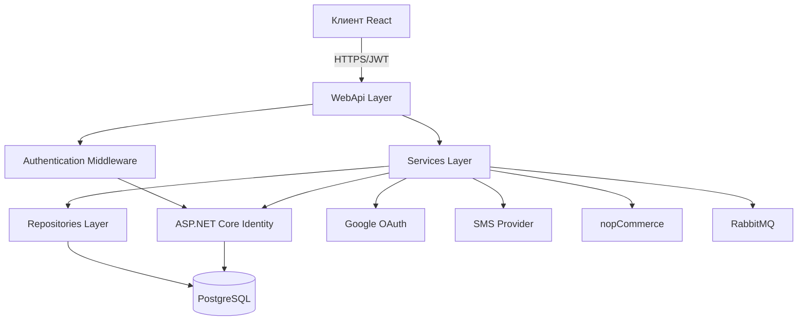

# Документ проектирования: Микросервис аутентификации пользователей

## Обзор

Микросервис аутентификации пользователей представляет собой автономный сервис, построенный на ASP.NET Core 8.0 с использованием принципов чистой архитектуры (Clean Architecture). Сервис обеспечивает полный цикл управления пользователями: регистрацию, аутентификацию, авторизацию и управление профилями. Система интегрируется с внешними сервисами (Google OAuth, SMS провайдер, nopCommerce) и использует JWT токены для stateless аутентификации.

### Ключевые характеристики

- **Архитектурный стиль**: Чистая архитектура с разделением на слои Domain, Services, Infrastructure и WebApi
- **База данных**: PostgreSQL с использованием Entity Framework Core
- **Аутентификация**: JWT токены с refresh механизмом
- **Безопасность**: ASP.NET Core Identity, PBKDF2 хеширование паролей, rate limiting
- **Интеграции**: Google OAuth 2.0, SMS провайдер, nopCommerce, RabbitMQ
- **Контейнеризация**: Docker с поддержкой Kubernetes

## Архитектура

### Общая структура решения

Микросервис следует принципам чистой архитектуры с четким разделением ответственности между слоями. Расположен в структуре проекта по адресу `apps/user-authentication-service/`:

```
apps/user-authentication-service/
├── Domain/
│   └── Domain.Entities/              # Доменные сущности
├── Services/
│   ├── Services.Abstractions/        # Интерфейсы бизнес-сервисов
│   ├── Services.Contracts/           # DTO контракты
│   ├── Services.Implementations/     # Реализация бизнес-логики
│   └── Services.Repositories.Abstractions/  # Интерфейсы репозиториев
├── Infrastructure/
│   ├── Infrastructure.EntityFramework/      # DbContext, конфигурации EF
│   ├── Infrastructure.Repositories.Implementations/  # Реализация репозиториев
│   ├── Infrastructure.Identity/      # Настройка ASP.NET Core Identity
│   ├── Infrastructure.ExternalServices/  # Интеграции (SMS, Google, nopCommerce)
│   └── Services.UnitTests/           # Модульные тесты
├── WebApi/                           # REST API, контроллеры, middleware
│   ├── Controllers/
│   ├── Middleware/
│   ├── Models/                       # View models для API
│   ├── Mapping/                      # AutoMapper профили
│   └── Settings/                     # Конфигурационные классы
├── k8s/                              # Kubernetes манифесты
│   ├── deployment.yaml
│   ├── service.yaml
│   └── hpa.yaml
├── manifests/                        # ConfigMap и Secret
│   ├── configmap.yaml
│   └── secret.yaml
├── Dockerfile
├── UserAuthenticationService.sln
└── README.md
```

### Диаграмма компонентов



### Слои архитектуры

#### 1. Domain Layer (Доменный слой)

Содержит доменные сущности и бизнес-правила. Не имеет зависимостей от других слоев.

**Основные сущности:**
- `User` - пользователь системы
- `RefreshToken` - токен обновления
- `PhoneVerificationCode` - код подтверждения телефона
- `UserSubscription` - подписка пользователя
- `AuthenticationLog` - лог операций аутентификации

#### 2. Services Layer (Слой сервисов)

Содержит бизнес-логику приложения. Зависит только от Domain слоя.

**Основные сервисы:**
- `IAuthenticationService` - регистрация, вход, выход
- `ITokenService` - генерация и валидация JWT токенов
- `IUserProfileService` - управление профилем пользователя
- `IPasswordService` - работа с паролями
- `IPhoneVerificationService` - подтверждение телефона
- `ISubscriptionService` - управление подписками
- `IGoogleAuthService` - аутентификация через Google

#### 3. Infrastructure Layer (Инфраструктурный слой)

Содержит реализацию технических деталей: доступ к данным, внешние интеграции.

**Компоненты:**
- `DatabaseContext` - контекст Entity Framework
- Репозитории для работы с данными
- `IdentityConfiguration` - настройка ASP.NET Core Identity
- `SmsService` - интеграция с SMS провайдером
- `GoogleOAuthService` - интеграция с Google
- `NopCommerceClient` - интеграция с nopCommerce
- `RabbitMqPublisher` - публикация событий в RabbitMQ

#### 4. WebApi Layer (Слой представления)

Содержит REST API контроллеры, middleware, конфигурацию.

**Компоненты:**
- Контроллеры API
- JWT Authentication Middleware
- Rate Limiting Middleware
- Exception Handling Middleware
- CORS конфигурация
- Swagger документация

## Компоненты и интерфейсы

### 1. Authentication Service (Сервис аутентификации)

**Интерфейс:**
```csharp
public interface IAuthenticationService
{
    Task<AuthenticationResult> RegisterAsync(RegisterRequest request, CancellationToken cancellationToken);
    Task<AuthenticationResult> LoginAsync(LoginRequest request, CancellationToken cancellationToken);
    Task<AuthenticationResult> LoginWithGoogleAsync(GoogleAuthRequest request, CancellationToken cancellationToken);
    Task<AuthenticationResult> RefreshTokenAsync(string refreshToken, CancellationToken cancellationToken);
    Task LogoutAsync(Guid userId, CancellationToken cancellationToken);
}
```

**Ответственность:**
- Регистрация новых пользователей с валидацией данных
- Аутентификация по логину/паролю
- Аутентификация через Google OAuth
- Обновление JWT токенов через refresh токен
- Выход из системы с отзывом токенов

**Зависимости:**
- `UserManager<User>` (ASP.NET Core Identity)
- `ITokenService`
- `IPhoneVerificationService`
- `IGoogleAuthService`
- `IUserRepository`
- `IRefreshTokenRepository`

### 2. Token Service (Сервис токенов)

**Интерфейс:**
```csharp
public interface ITokenService
{
    string GenerateJwtToken(User user, IList<string> roles);
    Task<RefreshToken> GenerateRefreshTokenAsync(Guid userId, bool rememberMe, CancellationToken cancellationToken);
    Task<bool> ValidateRefreshTokenAsync(string token, CancellationToken cancellationToken);
    Task RevokeRefreshTokenAsync(string token, CancellationToken cancellationToken);
    Task RevokeAllUserTokensAsync(Guid userId, CancellationToken cancellationToken);
}
```

**Ответственность:**
- Генерация JWT токенов с claims пользователя
- Генерация refresh токенов с настраиваемым временем жизни
- Валидация refresh токенов
- Отзыв токенов при выходе или смене пароля

**Конфигурация JWT:**
- Алгоритм: HS256
- Время жизни access token: 15 минут
- Время жизни refresh token: 7 дней (30 дней с "Запомнить меня")
- Claims: UserId, Email, UserName, Roles

### 3. Phone Verification Service (Сервис подтверждения телефона)

**Интерфейс:**
```csharp
public interface IPhoneVerificationService
{
    Task<SendCodeResult> SendVerificationCodeAsync(string phoneNumber, CancellationToken cancellationToken);
    Task<VerificationResult> VerifyCodeAsync(string phoneNumber, string code, CancellationToken cancellationToken);
    Task<SendCodeResult> ResendCodeAsync(string phoneNumber, CancellationToken cancellationToken);
}
```

**Ответственность:**
- Генерация 6-значных числовых кодов
- Отправка кодов через SMS провайдер
- Валидация кодов с проверкой срока действия (10 минут)
- Rate limiting: максимум 3 отправки в час на номер

**Зависимости:**
- `ISmsService` (интеграция с SMS провайдером)
- `IPhoneVerificationCodeRepository`

### 4. User Profile Service (Сервис профиля пользователя)

**Интерфейс:**
```csharp
public interface IUserProfileService
{
    Task<UserProfileDto> GetProfileAsync(Guid userId, CancellationToken cancellationToken);
    Task<UpdateProfileResult> UpdateProfileAsync(Guid userId, UpdateProfileRequest request, CancellationToken cancellationToken);
    Task<ChangePasswordResult> ChangePasswordAsync(Guid userId, ChangePasswordRequest request, CancellationToken cancellationToken);
    Task<DeleteAccountResult> DeleteAccountAsync(Guid userId, CancellationToken cancellationToken);
}
```

**Ответственность:**
- Получение данных профиля пользователя
- Обновление профиля с валидацией уникальности email
- Смена пароля с отзывом всех токенов
- Мягкое удаление аккаунта (soft delete)

### 5. Password Service (Сервис паролей)

**Интерфейс:**
```csharp
public interface IPasswordService
{
    string GenerateSecurePassword();
    Task<bool> ValidatePasswordAsync(string password);
    PasswordStrength EvaluatePasswordStrength(string password);
}
```

**Ответственность:**
- Генерация криптографически случайных паролей (16 символов)
- Валидация паролей по правилам (минимум 8 символов, заглавная буква, цифра)
- Оценка надежности пароля

### 6. Subscription Service (Сервис подписок)

**Интерфейс:**
```csharp
public interface ISubscriptionService
{
    Task<IEnumerable<UserSubscriptionDto>> GetUserSubscriptionsAsync(Guid userId, CancellationToken cancellationToken);
    Task<IEnumerable<SubscriptionPlanDto>> GetAvailablePlansAsync(CancellationToken cancellationToken);
    Task<SubscribeResult> SubscribeAsync(Guid userId, int planId, CancellationToken cancellationToken);
    Task<CancelSubscriptionResult> CancelSubscriptionAsync(Guid userId, int subscriptionId, CancellationToken cancellationToken);
    Task<bool> HasActiveSubscriptionAsync(Guid userId, CancellationToken cancellationToken);
}
```

**Ответственность:**
- Получение подписок пользователя из nopCommerce
- Получение доступных планов подписок
- Оформление новой подписки через nopCommerce
- Отмена подписки
- Проверка наличия активной подписки при входе

**Зависимости:**
- `INopCommerceClient` (HTTP клиент для внешнего nopCommerce API)
- `IUserSubscriptionRepository`

**Примечание:** nopCommerce развернут как отдельный внешний сервис. Микросервис аутентификации взаимодействует с ним через REST API, используя HTTP клиент с настроенной retry политикой для обеспечения устойчивости.

### 7. Google Auth Service (Сервис Google аутентификации)

**Интерфейс:**
```csharp
public interface IGoogleAuthService
{
    Task<GoogleUserInfo> ValidateGoogleTokenAsync(string idToken, CancellationToken cancellationToken);
    Task<User> GetOrCreateUserFromGoogleAsync(GoogleUserInfo googleInfo, CancellationToken cancellationToken);
}
```

**Ответственность:**
- Валидация Google ID токена
- Получение информации о пользователе от Google
- Создание нового пользователя или связывание с существующим по email

### 8. SMS Service (Сервис SMS)

**Интерфейс:**
```csharp
public interface ISmsService
{
    Task<SendSmsResult> SendSmsAsync(string phoneNumber, string message, CancellationToken cancellationToken);
}
```

**Ответственность:**
- Отправка SMS через внешний провайдер (Twilio, SMS.ru и т.д.)
- Обработка ошибок отправки
- Логирование отправленных сообщений

### 9. NopCommerce Client (Клиент nopCommerce)

**Интерфейс:**
```csharp
public interface INopCommerceClient
{
    Task<IEnumerable<SubscriptionPlanDto>> GetSubscriptionPlansAsync(CancellationToken cancellationToken);
    Task<IEnumerable<UserSubscriptionDto>> GetUserSubscriptionsAsync(Guid userId, CancellationToken cancellationToken);
    Task<CreateSubscriptionResult> CreateSubscriptionAsync(Guid userId, int planId, CancellationToken cancellationToken);
    Task<UpdateSubscriptionResult> UpdateSubscriptionStatusAsync(int subscriptionId, SubscriptionStatus status, CancellationToken cancellationToken);
}
```

**Ответственность:**
- HTTP взаимодействие с внешним nopCommerce API (развернут отдельно)
- Синхронизация данных о подписках между микросервисом и nopCommerce
- Обработка ошибок интеграции и таймаутов
- Реализация retry политики для устойчивости к временным сбоям

**Конфигурация:**
- Base URL внешнего nopCommerce API (например: `https://shop.example.com/api`)
- API ключ для аутентификации запросов
- Таймауты HTTP запросов (по умолчанию: 30 секунд)
- Retry политика: 3 попытки с экспоненциальной задержкой

## Модели данных

### User (Пользователь)

Наследуется от `IdentityUser<Guid>` для интеграции с ASP.NET Core Identity.

```csharp
public class User : IdentityUser<Guid>
{
    // Унаследованные от IdentityUser:
    // Id (Guid)
    // UserName (string)
    // Email (string)
    // PhoneNumber (string)
    // PasswordHash (string)
    // EmailConfirmed (bool)
    // PhoneNumberConfirmed (bool)
    // TwoFactorEnabled (bool)
    // LockoutEnd (DateTimeOffset?)
    // LockoutEnabled (bool)
    // AccessFailedCount (int)
    
    // Дополнительные поля:
    public string? FirstName { get; set; }
    public string? LastName { get; set; }
    public string? MiddleName { get; set; }
    public string? GoogleId { get; set; }
    public DateTime CreatedAt { get; set; }
    public DateTime UpdatedAt { get; set; }
    public bool IsActive { get; set; }
    public bool Deleted { get; set; }
    
    // Навигационные свойства:
    public ICollection<RefreshToken> RefreshTokens { get; set; }
    public ICollection<UserSubscription> Subscriptions { get; set; }
    public ICollection<AuthenticationLog> AuthenticationLogs { get; set; }
}
```

**Индексы:**
- `Email` (уникальный)
- `UserName` (уникальный)
- `GoogleId` (уникальный, nullable)
- `PhoneNumber` (уникальный)

### RefreshToken (Токен обновления)

```csharp
public class RefreshToken
{
    public int Id { get; set; }
    public Guid UserId { get; set; }
    public string Token { get; set; }  // Криптографически случайная строка
    public DateTime ExpiresAt { get; set; }
    public DateTime CreatedAt { get; set; }
    public DateTime? RevokedAt { get; set; }
    public bool IsRevoked { get; set; }
    public string? RevokedByIp { get; set; }
    public string? ReplacedByToken { get; set; }  // Для цепочки токенов
    
    // Навигационные свойства:
    public User User { get; set; }
}
```

**Индексы:**
- `Token` (уникальный)
- `UserId, IsRevoked, ExpiresAt` (составной для быстрого поиска активных токенов)

### PhoneVerificationCode (Код подтверждения телефона)

```csharp
public class PhoneVerificationCode
{
    public int Id { get; set; }
    public string PhoneNumber { get; set; }
    public string Code { get; set; }  // 6-значный числовой код
    public DateTime ExpiresAt { get; set; }
    public bool IsUsed { get; set; }
    public DateTime CreatedAt { get; set; }
    public DateTime? UsedAt { get; set; }
    public int AttemptCount { get; set; }  // Количество попыток проверки
}
```

**Индексы:**
- `PhoneNumber, IsUsed, ExpiresAt` (составной для поиска активных кодов)

### UserSubscription (Подписка пользователя)

```csharp
public class UserSubscription
{
    public int Id { get; set; }
    public Guid UserId { get; set; }
    public int SubscriptionPlanId { get; set; }
    public string PlanName { get; set; }
    public DateTime StartDate { get; set; }
    public DateTime EndDate { get; set; }
    public bool IsActive { get; set; }
    public bool AutoRenew { get; set; }
    public DateTime CreatedAt { get; set; }
    public DateTime? CancelledAt { get; set; }
    public string? NopCommerceOrderId { get; set; }  // ID заказа в nopCommerce
    
    // Навигационные свойства:
    public User User { get; set; }
}
```

**Индексы:**
- `UserId, IsActive` (составной для быстрого поиска активных подписок)
- `NopCommerceOrderId` (для синхронизации)

### AuthenticationLog (Лог аутентификации)

```csharp
public class AuthenticationLog
{
    public long Id { get; set; }
    public Guid? UserId { get; set; }
    public string? UserName { get; set; }
    public AuthenticationEventType EventType { get; set; }  // Login, Logout, FailedLogin, PasswordChange, etc.
    public bool Success { get; set; }
    public string? FailureReason { get; set; }
    public string IpAddress { get; set; }
    public string? UserAgent { get; set; }
    public DateTime Timestamp { get; set; }
    public LogLevel LogLevel { get; set; }  // Information, Warning, Error
    
    // Навигационные свойства:
    public User? User { get; set; }
}
```

**Индексы:**
- `UserId, Timestamp` (составной для аудита)
- `IpAddress, Timestamp` (для отслеживания подозрительной активности)
- `EventType, Timestamp` (для аналитики)

### DTO контракты

**RegisterRequest:**
```csharp
public class RegisterRequest
{
    public string UserName { get; set; }
    public string Email { get; set; }
    public string PhoneNumber { get; set; }
    public string Password { get; set; }
    public string ConfirmPassword { get; set; }
    public string? FirstName { get; set; }
    public string? LastName { get; set; }
    public string? MiddleName { get; set; }
}
```

**LoginRequest:**
```csharp
public class LoginRequest
{
    public string UserName { get; set; }
    public string Password { get; set; }
    public bool RememberMe { get; set; }
}
```

**AuthenticationResult:**
```csharp
public class AuthenticationResult
{
    public bool Success { get; set; }
    public string? AccessToken { get; set; }
    public string? RefreshToken { get; set; }
    public DateTime? ExpiresAt { get; set; }
    public UserDto? User { get; set; }
    public IEnumerable<string>? Errors { get; set; }
    public bool RequiresPhoneVerification { get; set; }
}
```

## Свойства корректности

*Свойство корректности — это характеристика или поведение, которое должно выполняться во всех допустимых сценариях работы системы. По сути, это формальное утверждение о том, что система должна делать. Свойства служат мостом между человекочитаемыми спецификациями и машинно-проверяемыми гарантиями корректности.*

