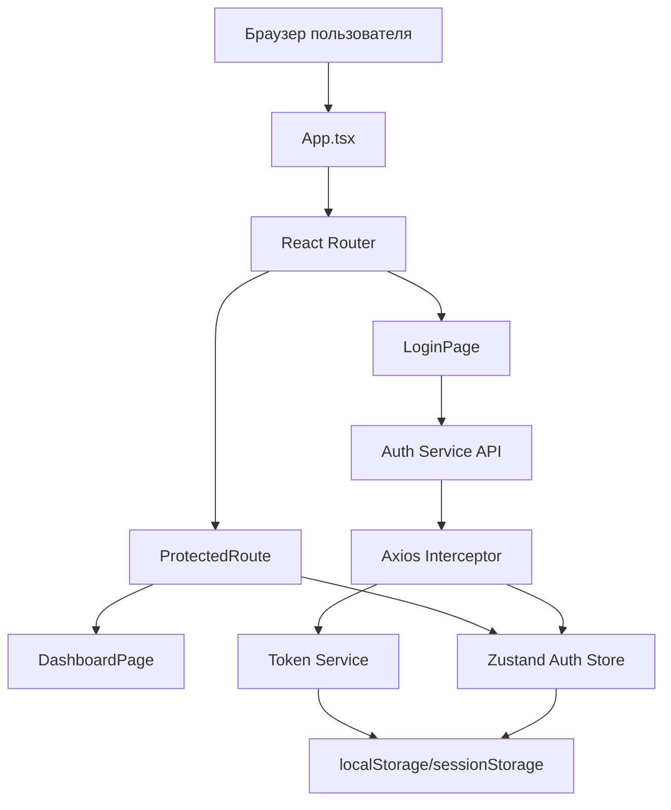
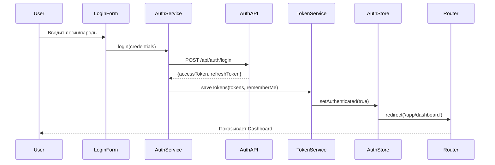

# Документ проектирования: User Portal

## Обзор

User Portal - это фронтенд SPA (Single Page Application) на базе React 18+ и TypeScript, предоставляющий пользовательский интерфейс для авторизации, регистрации и доступа к личному кабинету. Приложение использует Blueprint UI библиотеку для компонентов, интегрируется с существующим Auth Service через HTTP API и использует JWT токены для аутентификации.

### Ключевые характеристики

- **Архитектурный подход**: Чистая архитектура (Clean Architecture) с разделением на слои
- **Технологический стек**: React 18+, TypeScript, Blueprint UI, React Router, Zustand
- **Сборка**: Vite для быстрой разработки и оптимизированной production сборки
- **Аутентификация**: JWT токены с автоматическим обновлением через refresh токены
- **Маршрутизация**: React Router v6 с защищенными маршрутами
- **Управление состоянием**: Zustand для глобального состояния аутентификации
- **HTTP клиент**: Axios с interceptors для автоматического добавления токенов
- **Развертывание**: Docker контейнер с Nginx, Kubernetes манифесты
- **Адаптивность**: Мобильная, планшетная и десктопная версии

## Архитектура

### Принципы чистой архитектуры

User Portal следует принципам чистой архитектуры (Clean Architecture) для фронтенд-приложений, обеспечивая:

**Разделение ответственности:**
- **Presentation Layer (Слой представления)**: React компоненты, отвечающие только за отображение UI
- **Application Layer (Слой приложения)**: Бизнес-логика, hooks, управление состоянием
- **Domain Layer (Доменный слой)**: Типы, интерфейсы, модели данных
- **Infrastructure Layer (Инфраструктурный слой)**: Сервисы для работы с внешними API, хранилищем

**Ключевые принципы:**

1. **Независимость от фреймворков**: Бизнес-логика не зависит от React или других библиотек
2. **Тестируемость**: Каждый слой можно тестировать независимо
3. **Независимость от UI**: Логика не зависит от конкретных UI компонентов
4. **Независимость от внешних сервисов**: Использование интерфейсов для абстракции внешних зависимостей
5. **Правило зависимостей**: Зависимости направлены внутрь - внешние слои зависят от внутренних, но не наоборот

**Структура слоев:**

```
┌─────────────────────────────────────────┐
│   Presentation Layer (components/)      │  ← React компоненты, UI
│   - LoginForm, RegisterForm, Header     │
└─────────────────────────────────────────┘
              ↓ зависит от
┌─────────────────────────────────────────┐
│   Application Layer (hooks/, store/)    │  ← Бизнес-логика, состояние
│   - useAuth, authStore                  │
└─────────────────────────────────────────┘
              ↓ зависит от
┌─────────────────────────────────────────┐
│   Domain Layer (types/)                 │  ← Типы, интерфейсы
│   - User, AuthResponse, IAuthService    │
└─────────────────────────────────────────┘
              ↑ реализуют
┌─────────────────────────────────────────┐
│   Infrastructure Layer (services/)      │  ← Внешние интеграции
│   - authService, tokenService, api      │
└─────────────────────────────────────────┘
```

**Преимущества подхода:**
- Легкость замены внешних зависимостей (например, замена Zustand на Redux)
- Простота тестирования каждого слоя изолированно
- Четкое разделение ответственности между компонентами
- Возможность переиспользования бизнес-логики
- Упрощение поддержки и расширения приложения

### Общая структура проекта

```
apps/user-portal/
├── src/
│   ├── presentation/        # Presentation Layer - UI компоненты
│   │   ├── components/
│   │   │   ├── auth/       # Компоненты авторизации
│   │   │   │   ├── LoginForm.tsx
│   │   │   │   ├── RegisterForm.tsx
│   │   │   │   └── GoogleAuthButton.tsx
│   │   │   ├── layout/     # Компоненты layout
│   │   │   │   ├── Header.tsx
│   │   │   │   └── ProtectedRoute.tsx
│   │   │   └── common/     # Общие компоненты
│   │   │       ├── ErrorBoundary.tsx
│   │   │       └── LoadingSpinner.tsx
│   │   └── pages/          # Страницы приложения
│   │       ├── LoginPage.tsx
│   │       ├── DashboardPage.tsx
│   │       └── PaymentPage.tsx
│   ├── application/         # Application Layer - бизнес-логика
│   │   ├── hooks/          # Custom React hooks
│   │   │   └── useAuth.ts
│   │   ├── store/          # Zustand store
│   │   │   └── authStore.ts
│   │   └── use-cases/      # Use cases (опционально)
│   │       └── loginUseCase.ts
│   ├── domain/              # Domain Layer - типы и интерфейсы
│   │   ├── entities/       # Доменные сущности
│   │   │   └── User.ts
│   │   ├── interfaces/     # Интерфейсы сервисов
│   │   │   ├── IAuthService.ts
│   │   │   └── ITokenService.ts
│   │   └── types/          # TypeScript типы
│   │       ├── auth.types.ts
│   │       └── api.types.ts
│   ├── infrastructure/      # Infrastructure Layer - внешние интеграции
│   │   ├── services/       # Реализация сервисов
│   │   │   ├── api.ts     # Axios instance с interceptors
│   │   │   ├── authService.ts
│   │   │   └── tokenService.ts
│   │   └── utils/          # Утилиты
│   │       ├── validation.ts
│   │       └── storage.ts
│   ├── App.tsx              # Главный компонент приложения
│   ├── main.tsx             # Точка входа
│   └── index.css            # Глобальные стили
├── public/                  # Статические файлы
├── k8s/                     # Kubernetes манифесты
│   ├── deployment.yaml
│   ├── service.yaml
│   └── ingress.yaml
├── nginx/                   # Nginx конфигурация
│   └── nginx.conf
├── Dockerfile
├── package.json
├── tsconfig.json
├── vite.config.ts
└── README.md
```

### Диаграмма компонентов



### Поток аутентификации



## Компоненты и интерфейсы

### 1. Auth Service (Сервис аутентификации)

**Файл:** `src/infrastructure/services/authService.ts`

**Интерфейс:** `src/domain/interfaces/IAuthService.ts`

```typescript
interface IAuthService {
  login(credentials: LoginCredentials): Promise<AuthResponse>;
  register(data: RegisterData): Promise<AuthResponse>;
  loginWithGoogle(idToken: string): Promise<AuthResponse>;
  refreshToken(): Promise<AuthResponse>;
  logout(): Promise<void>;
}
```

**Ответственность:**
- Отправка запросов на Auth Service API
- Обработка ответов и ошибок от API
- Сохранение JWT токенов через Token Service
- Обновление состояния аутентификации в Zustand store

**Методы:**

```typescript
// Вход по логину и паролю
async login(credentials: LoginCredentials): Promise<AuthResponse> {
  const response = await api.post('/api/auth/login', {
    userName: credentials.username,
    password: credentials.password,
    rememberMe: credentials.rememberMe
  });
  
  await tokenService.saveTokens(
    response.data.accessToken,
    response.data.refreshToken,
    credentials.rememberMe
  );
  
  authStore.setUser(response.data.user);
  authStore.setAuthenticated(true);
  
  return response.data;
}

// Регистрация нового пользователя
async register(data: RegisterData): Promise<AuthResponse> {
  const response = await api.post('/api/auth/register', {
    userName: data.username,
    email: data.email,
    phoneNumber: data.phone,
    password: data.password,
    confirmPassword: data.confirmPassword,
    firstName: data.firstName,
    lastName: data.lastName,
    middleName: data.middleName
  });
  
  await tokenService.saveTokens(
    response.data.accessToken,
    response.data.refreshToken,
    false
  );
  
  authStore.setUser(response.data.user);
  authStore.setAuthenticated(true);
  
  return response.data;
}

// Вход через Google OAuth
async loginWithGoogle(idToken: string): Promise<AuthResponse> {
  const response = await api.post('/api/auth/google', { idToken });
  
  await tokenService.saveTokens(
    response.data.accessToken,
    response.data.refreshToken,
    false
  );
  
  authStore.setUser(response.data.user);
  authStore.setAuthenticated(true);
  
  return response.data;
}

// Обновление JWT токена
async refreshToken(): Promise<AuthResponse> {
  const refreshToken = tokenService.getRefreshToken();
  
  if (!refreshToken) {
    throw new Error('No refresh token available');
  }
  
  const response = await api.post('/api/auth/refresh', { refreshToken });
  
  await tokenService.saveTokens(
    response.data.accessToken,
    response.data.refreshToken,
    tokenService.isRememberMe()
  );
  
  return response.data;
}

// Выход из системы
async logout(): Promise<void> {
  try {
    await api.post('/api/auth/logout');
  } finally {
    tokenService.clearTokens();
    authStore.setAuthenticated(false);
    authStore.setUser(null);
  }
}
```

### 2. Token Service (Сервис управления токенами)

**Файл:** `src/infrastructure/services/tokenService.ts`

**Интерфейс:** `src/domain/interfaces/ITokenService.ts`

```typescript
interface ITokenService {
  saveTokens(accessToken: string, refreshToken: string, rememberMe: boolean): void;
  getAccessToken(): string | null;
  getRefreshToken(): string | null;
  clearTokens(): void;
  isRememberMe(): boolean;
}
```

**Ответственность:**
- Сохранение JWT токенов в localStorage или sessionStorage
- Получение токенов из хранилища
- Удаление токенов при выходе
- Определение типа хранилища на основе "Запомнить меня"

**Реализация:**

```typescript
class TokenService implements ITokenService {
  private readonly ACCESS_TOKEN_KEY = 'access_token';
  private readonly REFRESH_TOKEN_KEY = 'refresh_token';
  private readonly REMEMBER_ME_KEY = 'remember_me';
  
  saveTokens(accessToken: string, refreshToken: string, rememberMe: boolean): void {
    const storage = rememberMe ? localStorage : sessionStorage;
    
    storage.setItem(this.ACCESS_TOKEN_KEY, accessToken);
    storage.setItem(this.REFRESH_TOKEN_KEY, refreshToken);
    storage.setItem(this.REMEMBER_ME_KEY, rememberMe.toString());
  }
  
  getAccessToken(): string | null {
    return this.getFromStorage(this.ACCESS_TOKEN_KEY);
  }
  
  getRefreshToken(): string | null {
    return this.getFromStorage(this.REFRESH_TOKEN_KEY);
  }
  
  clearTokens(): void {
    localStorage.removeItem(this.ACCESS_TOKEN_KEY);
    localStorage.removeItem(this.REFRESH_TOKEN_KEY);
    localStorage.removeItem(this.REMEMBER_ME_KEY);
    sessionStorage.removeItem(this.ACCESS_TOKEN_KEY);
    sessionStorage.removeItem(this.REFRESH_TOKEN_KEY);
    sessionStorage.removeItem(this.REMEMBER_ME_KEY);
  }
  
  isRememberMe(): boolean {
    const rememberMe = this.getFromStorage(this.REMEMBER_ME_KEY);
    return rememberMe === 'true';
  }
  
  private getFromStorage(key: string): string | null {
    return localStorage.getItem(key) || sessionStorage.getItem(key);
  }
}
```

### 3. Axios Instance с Interceptors

**Файл:** `src/infrastructure/services/api.ts`

**Ответственность:**
- Создание настроенного Axios instance
- Автоматическое добавление JWT токена в заголовки запросов
- Автоматическое обновление токена при истечении (401 ошибка)
- Обработка ошибок сети и API

**Реализация:**

```typescript
import axios, { AxiosError, AxiosRequestConfig } from 'axios';
import { tokenService } from './tokenService';
import { authService } from './authService';

const api = axios.create({
  baseURL: '/api',
  timeout: 30000,
  headers: {
    'Content-Type': 'application/json'
  }
});

// Request interceptor - добавление токена
api.interceptors.request.use(
  (config) => {
    const token = tokenService.getAccessToken();
    
    if (token) {
      config.headers.Authorization = `Bearer ${token}`;
    }
    
    return config;
  },
  (error) => {
    return Promise.reject(error);
  }
);

// Response interceptor - обработка 401 и обновление токена
let isRefreshing = false;
let failedQueue: Array<{
  resolve: (value?: unknown) => void;
  reject: (reason?: unknown) => void;
}> = [];

const processQueue = (error: Error | null, token: string | null = null) => {
  failedQueue.forEach(prom => {
    if (error) {
      prom.reject(error);
    } else {
      prom.resolve(token);
    }
  });
  
  failedQueue = [];
};

api.interceptors.response.use(
  (response) => response,
  async (error: AxiosError) => {
    const originalRequest = error.config as AxiosRequestConfig & { _retry?: boolean };
    
    // Если 401 и это не повторный запрос
    if (error.response?.status === 401 && !originalRequest._retry) {
      if (isRefreshing) {
        // Если уже идет обновление токена, добавляем запрос в очередь
        return new Promise((resolve, reject) => {
          failedQueue.push({ resolve, reject });
        }).then(() => {
          return api(originalRequest);
        }).catch(err => {
          return Promise.reject(err);
        });
      }
      
      originalRequest._retry = true;
      isRefreshing = true;
      
      try {
        await authService.refreshToken();
        processQueue(null);
        return api(originalRequest);
      } catch (refreshError) {
        processQueue(refreshError as Error);
        tokenService.clearTokens();
        window.location.href = '/app/login';
        return Promise.reject(refreshError);
      } finally {
        isRefreshing = false;
      }
    }
    
    return Promise.reject(error);
  }
);

export default api;
```

### 4. Auth Store (Zustand хранилище)

**Файл:** `src/application/store/authStore.ts`

**Интерфейс:**
```typescript
interface AuthState {
  isAuthenticated: boolean;
  user: User | null;
  isLoading: boolean;
  error: string | null;
  
  setAuthenticated: (value: boolean) => void;
  setUser: (user: User | null) => void;
  setLoading: (value: boolean) => void;
  setError: (error: string | null) => void;
  reset: () => void;
}
```

**Ответственность:**
- Хранение состояния аутентификации
- Хранение данных текущего пользователя
- Управление состоянием загрузки и ошибок
- Предоставление методов для обновления состояния

**Реализация:**

```typescript
import { create } from 'zustand';
import { User } from '../../domain/entities/User';

interface AuthState {
  isAuthenticated: boolean;
  user: User | null;
  isLoading: boolean;
  error: string | null;
  
  setAuthenticated: (value: boolean) => void;
  setUser: (user: User | null) => void;
  setLoading: (value: boolean) => void;
  setError: (error: string | null) => void;
  reset: () => void;
}

export const useAuthStore = create<AuthState>((set) => ({
  isAuthenticated: false,
  user: null,
  isLoading: false,
  error: null,
  
  setAuthenticated: (value) => set({ isAuthenticated: value }),
  setUser: (user) => set({ user }),
  setLoading: (value) => set({ isLoading: value }),
  setError: (error) => set({ error }),
  reset: () => set({
    isAuthenticated: false,
    user: null,
    isLoading: false,
    error: null
  })
}));
```

### 5. Protected Route Component

**Файл:** `src/presentation/components/layout/ProtectedRoute.tsx`

**Ответственность:**
- Проверка наличия валидного JWT токена
- Редирект на /app/login если пользователь не авторизован
- Отображение защищенного контента для авторизованных пользователей

**Реализация:**

```typescript
import React from 'react';
import { Navigate, Outlet } from 'react-router-dom';
import { useAuthStore } from '../../../application/store/authStore';
import { tokenService } from '../../../infrastructure/services/tokenService';

export const ProtectedRoute: React.FC = () => {
  const isAuthenticated = useAuthStore(state => state.isAuthenticated);
  const hasToken = tokenService.getAccessToken() !== null;
  
  if (!isAuthenticated && !hasToken) {
    return <Navigate to="/app/login" replace />;
  }
  
  return <Outlet />;
};
```

### 6. Login Form Component

**Файл:** `src/presentation/components/auth/LoginForm.tsx`

**Ответственность:**
- Отображение формы входа с полями логин, пароль, "Запомнить меня"
- Валидация полей на клиенте
- Отправка данных на Auth Service
- Отображение ошибок через Blueprint Callout

**Основные поля:**
- `username` - логин или email
- `password` - пароль
- `rememberMe` - чекбокс "Запомнить меня"

**Валидация:**
- Все поля обязательны
- Минимальная длина пароля: 8 символов

### 7. Register Form Component

**Файл:** `src/presentation/components/auth/RegisterForm.tsx`

**Ответственность:**
- Отображение формы регистрации
- Валидация полей на клиенте
- Отправка данных на Auth Service
- Отображение ошибок через Blueprint Callout

**Основные поля:**
- `username` - логин
- `email` - email адрес
- `phone` - номер телефона
- `password` - пароль
- `confirmPassword` - подтверждение пароля
- `firstName`, `lastName`, `middleName` - ФИО (опционально)

**Валидация:**
- Email должен соответствовать формату email
- Пароль минимум 8 символов
- Пароль и подтверждение должны совпадать
- Телефон должен соответствовать формату

### 8. Google Auth Button Component

**Файл:** `src/presentation/components/auth/GoogleAuthButton.tsx`

**Ответственность:**
- Отображение кнопки "Войти через Google"
- Инициация Google OAuth flow
- Отправка Google ID токена на Auth Service

**Интеграция:**
- Использование Google Identity Services (GIS) библиотеки
- Получение ID токена от Google
- Отправка токена на /api/auth/google

### 9. Header Component

**Файл:** `src/presentation/components/layout/Header.tsx`

**Ответственность:**
- Отображение логотипа/названия платформы
- Отображение логина пользователя
- Кнопка "Выйти"
- Адаптивная навигация для мобильных устройств

**Структура:**
```typescript
interface HeaderProps {
  username: string;
  onLogout: () => void;
}
```

## Модели данных

### TypeScript типы

**Файл:** `src/domain/types/auth.types.ts`

```typescript
// Данные для входа
export interface LoginCredentials {
  username: string;
  password: string;
  rememberMe: boolean;
}

// Данные для регистрации
export interface RegisterData {
  username: string;
  email: string;
  phone: string;
  password: string;
  confirmPassword: string;
  firstName?: string;
  lastName?: string;
  middleName?: string;
}

// Ответ от Auth API
export interface AuthResponse {
  success: boolean;
  accessToken: string;
  refreshToken: string;
  expiresAt: string;
  user: User;
  errors?: string[];
  requiresPhoneVerification?: boolean;
}

// Данные для Google OAuth
export interface GoogleAuthRequest {
  idToken: string;
}

// Запрос на обновление токена
export interface RefreshTokenRequest {
  refreshToken: string;
}
```

**Файл:** `src/domain/entities/User.ts`

```typescript
// Пользователь
export interface User {
  id: string;
  userName: string;
  email: string;
  phoneNumber: string;
  firstName?: string;
  lastName?: string;
  middleName?: string;
  emailConfirmed: boolean;
  phoneNumberConfirmed: boolean;
}

// Ошибка API
export interface ApiError {
  message: string;
  errors?: Record<string, string[]>;
  statusCode: number;
}
```

## Свойства корректности

*Свойство корректности — это характеристика или поведение, которое должно выполняться во всех допустимых сценариях работы системы. По сути, это формальное утверждение о том, что система должна делать. Свойства служат мостом между человекочитаемыми спецификациями и машинно-проверяемыми гарантиями корректности.*


### Property Reflection

После анализа критериев приемки выявлены следующие избыточности:

1. **Дубликаты обновления токена**: Критерии 3.5 и 4.4 описывают одно и то же поведение - автоматическое обновление истекшего JWT токена. Объединяем в одно свойство.

2. **Редиректы при выходе**: Критерии 3.6 и 5.5 оба описывают выход из системы. Критерий 5.5 более полный (включает удаление токенов и редирект), поэтому используем его.

3. **Сохранение токенов**: Критерии 3.4, 4.1 и 4.2 описывают сохранение токенов. Можно объединить в два свойства: одно для localStorage (rememberMe=true), другое для sessionStorage (rememberMe=false).

4. **Редиректы для неавторизованных**: Критерии 6.1 и 6.3 описывают похожее поведение - редирект на /app/login при отсутствии валидного токена. Объединяем в одно свойство.

5. **Отображение ошибок**: Критерии 2.4, 8.1, 8.2, 8.3, 8.5 все описывают отображение ошибок. Можно объединить в несколько свойств по типам ошибок.

### Свойства корректности

**Property 1: Успешная авторизация приводит к редиректу на dashboard**

*Для любой* успешной авторизации или регистрации (через логин/пароль или Google OAuth), приложение должно выполнить редирект на /app/dashboard.

**Validates: Requirements 1.5**

---

**Property 2: Email валидация**

*Для любой* строки, введенной в поле email, валидатор должен принимать только строки, соответствующие стандартному формату email адреса (содержащие @ и домен).

**Validates: Requirements 2.1**

---

**Property 3: Валидация минимальной длины пароля**

*Для любой* строки, введенной в поле пароля при регистрации, валидатор должен отклонять строки короче 8 символов.

**Validates: Requirements 2.2**

---

**Property 4: Валидация совпадения паролей**

*Для любой* пары строк (пароль и подтверждение пароля), валидатор должен принимать только пары, где обе строки идентичны.

**Validates: Requirements 2.3**

---

**Property 5: Отображение ошибок валидации**

*Для любой* ошибки валидации формы, приложение должно отобразить Blueprint Callout компонент с описанием ошибки.

**Validates: Requirements 2.4**

---

**Property 6: Активация кнопки при валидной форме**

*Для любого* состояния формы, где все поля прошли валидацию, кнопка отправки формы должна быть активна (не disabled).

**Validates: Requirements 2.5**

---

**Property 7: Отправка запроса на вход**

*Для любых* учетных данных (логин, пароль, rememberMe), при отправке формы входа приложение должно отправить POST запрос на /api/auth/login с этими данными в теле запроса.

**Validates: Requirements 3.1**

---

**Property 8: Отправка запроса на регистрацию**

*Для любых* данных регистрации (логин, email, телефон, пароль, ФИО), при отправке формы регистрации приложение должно отправить POST запрос на /api/auth/register с этими данными в теле запроса.

**Validates: Requirements 3.2**

---

**Property 9: Отправка запроса Google OAuth**

*Для любого* Google ID токена, при нажатии кнопки "Войти через Google" приложение должно отправить POST запрос на /api/auth/google с этим токеном.

**Validates: Requirements 3.3**

---

**Property 10: Сохранение токенов в localStorage при "Запомнить меня"**

*Для любого* успешного ответа от Auth Service с JWT токенами, если пользователь отметил чекбокс "Запомнить меня", приложение должно сохранить accessToken и refreshToken в localStorage.

**Validates: Requirements 3.4, 4.1**

---

**Property 11: Сохранение токенов в sessionStorage без "Запомнить меня"**

*Для любого* успешного ответа от Auth Service с JWT токенами, если пользователь не отметил чекбокс "Запомнить меня", приложение должно сохранить accessToken и refreshToken в sessionStorage.

**Validates: Requirements 4.2**

---

**Property 12: Автоматическое добавление токена в заголовки**

*Для любого* HTTP запроса к защищенному API endpoint, Axios interceptor должен автоматически добавить JWT токен в заголовок Authorization в формате "Bearer {token}".

**Validates: Requirements 4.3**

---

**Property 13: Автоматическое обновление истекшего токена**

*Для любого* HTTP запроса, который возвращает ошибку 401 (Unauthorized), приложение должно автоматически попытаться обновить JWT токен через POST запрос на /api/auth/refresh с refresh токеном, а затем повторить исходный запрос с новым токеном.

**Validates: Requirements 3.5, 4.4**

---

**Property 14: Очистка токенов при неудачном обновлении**

*Для любой* неудачной попытки обновления токена (ошибка от /api/auth/refresh), приложение должно удалить все токены из localStorage и sessionStorage и выполнить редирект на /app/login.

**Validates: Requirements 4.5**

---

**Property 15: Выход из системы**

*Для любого* действия выхода из системы (нажатие кнопки "Выйти"), приложение должно: 1) отправить POST запрос на /api/auth/logout, 2) удалить все токены из хранилища, 3) выполнить редирект на /app/login.

**Validates: Requirements 3.6, 5.5**

---

**Property 16: Защита маршрутов от неавторизованных пользователей**

*Для любого* защищенного маршрута (например, /app/dashboard, /app/payment), если JWT токен отсутствует или истек, ProtectedRoute компонент должен выполнить редирект на /app/login.

**Validates: Requirements 6.1, 6.3**

---

**Property 17: Доступ к защищенным маршрутам с валидным токеном**

*Для любого* защищенного маршрута, если JWT токен присутствует и валиден, ProtectedRoute компонент должен разрешить доступ и отобразить запрашиваемую страницу.

**Validates: Requirements 6.4**

---

**Property 18: Отображение ошибок от API**

*Для любой* ошибки, возвращенной Auth Service API, приложение должно отобразить сообщение об ошибке через Blueprint Toast или Callout компонент.

**Validates: Requirements 8.1**

---

**Property 19: Обработка сетевых ошибок**

*Для любой* ошибки сети (таймаут, отсутствие соединения), приложение должно отобразить сообщение "Сервис временно недоступен".

**Validates: Requirements 8.2**

---

**Property 20: Отображение ошибок валидации от API**

*Для любого* ответа с HTTP статусом 400 от Auth Service, приложение должно извлечь ошибки валидации из ответа и отобразить их для соответствующих полей формы.

**Validates: Requirements 8.3**

---

**Property 21: Обработка ошибок авторизации**

*Для любого* ответа с HTTP статусом 401 от Auth Service (кроме случаев автоматического обновления токена), приложение должно удалить токены и выполнить редирект на /app/login.

**Validates: Requirements 8.4**

---

**Property 22: Адаптивность для мобильных устройств**

*Для любого* размера экрана шириной менее 768px, приложение должно применить мобильные стили и отобразить мобильную версию интерфейса.

**Validates: Requirements 9.1**

---

**Property 23: Адаптивность для планшетов**

*Для любого* размера экрана шириной от 768px до 1024px, приложение должно применить планшетные стили и отобразить планшетную версию интерфейса.

**Validates: Requirements 9.2**

---

**Property 24: Адаптивность для десктопов**

*Для любого* размера экрана шириной более 1024px, приложение должно применить десктопные стили и отобразить десктопную версию интерфейса.

**Validates: Requirements 9.3**

---

**Property 25: Динамическая адаптация при изменении размера**

*Для любого* изменения размера окна браузера, приложение должно автоматически адаптировать интерфейс к новому размеру без перезагрузки страницы.

**Validates: Requirements 9.4**

## Обработка ошибок

### Типы ошибок

1. **Ошибки валидации (400)**
   - Отображаются под соответствующими полями формы
   - Используется Blueprint FormGroup с intent="danger"
   - Сообщения извлекаются из ответа API

2. **Ошибки аутентификации (401)**
   - Автоматическая попытка обновления токена
   - При неудаче - очистка токенов и редирект на /app/login
   - Отображение Toast с сообщением "Сессия истекла"

3. **Ошибки авторизации (403)**
   - Отображение Toast с сообщением "Недостаточно прав"
   - Редирект на предыдущую страницу

4. **Ошибки "Не найдено" (404)**
   - Отображение страницы 404
   - Кнопка возврата на главную

5. **Серверные ошибки (500)**
   - Отображение Toast с общим сообщением
   - Логирование деталей в консоль (только в dev режиме)

6. **Сетевые ошибки**
   - Отображение Toast "Сервис временно недоступен"
   - Кнопка "Повторить попытку"

### Error Boundary

Использование React Error Boundary для перехвата ошибок рендеринга:

```typescript
class ErrorBoundary extends React.Component<Props, State> {
  componentDidCatch(error: Error, errorInfo: React.ErrorInfo) {
    console.error('React Error:', error, errorInfo);
    // Отправка в систему мониторинга (например, Sentry)
  }
  
  render() {
    if (this.state.hasError) {
      return <ErrorFallback />;
    }
    return this.props.children;
  }
}
```

## Стратегия тестирования

### Двойной подход к тестированию

User Portal требует комбинации unit тестов и property-based тестов для обеспечения корректности:

- **Unit тесты**: Проверяют конкретные примеры, edge cases и интеграционные точки между компонентами
- **Property тесты**: Проверяют универсальные свойства корректности для всех возможных входных данных

Оба типа тестов дополняют друг друга и необходимы для полного покрытия.

### Property-Based тестирование

Для React приложения будем использовать библиотеку **fast-check** для property-based тестирования.

**Конфигурация:**
- Минимум 100 итераций на каждый property тест
- Каждый тест должен ссылаться на свойство из документа дизайна
- Формат тега: **Feature: user-portal, Property {number}: {property_text}**

**Примеры property тестов:**

```typescript
// Property 2: Email валидация
// Feature: user-portal, Property 2: Email валидация
test('validates email format for all strings', () => {
  fc.assert(
    fc.property(fc.emailAddress(), (email) => {
      const result = validateEmail(email);
      expect(result.isValid).toBe(true);
    }),
    { numRuns: 100 }
  );
  
  fc.assert(
    fc.property(fc.string().filter(s => !s.includes('@')), (invalidEmail) => {
      const result = validateEmail(invalidEmail);
      expect(result.isValid).toBe(false);
    }),
    { numRuns: 100 }
  );
});

// Property 10: Сохранение токенов в localStorage при "Запомнить меня"
// Feature: user-portal, Property 10: Сохранение токенов в localStorage при "Запомнить меня"
test('saves tokens to localStorage when rememberMe is true', () => {
  fc.assert(
    fc.property(
      fc.string({ minLength: 20 }), // accessToken
      fc.string({ minLength: 20 }), // refreshToken
      (accessToken, refreshToken) => {
        tokenService.saveTokens(accessToken, refreshToken, true);
        
        expect(localStorage.getItem('access_token')).toBe(accessToken);
        expect(localStorage.getItem('refresh_token')).toBe(refreshToken);
        expect(sessionStorage.getItem('access_token')).toBeNull();
      }
    ),
    { numRuns: 100 }
  );
});

// Property 13: Автоматическое обновление истекшего токена
// Feature: user-portal, Property 13: Автоматическое обновление истекшего токена
test('automatically refreshes expired token on 401 response', async () => {
  fc.assert(
    fc.asyncProperty(
      fc.string({ minLength: 20 }), // oldToken
      fc.string({ minLength: 20 }), // newToken
      async (oldToken, newToken) => {
        // Mock API responses
        mockApi.onPost('/api/auth/refresh').reply(200, {
          accessToken: newToken,
          refreshToken: 'new-refresh-token'
        });
        
        mockApi.onGet('/api/protected').replyOnce(401).onGet('/api/protected').reply(200);
        
        tokenService.saveTokens(oldToken, 'refresh-token', false);
        
        await api.get('/api/protected');
        
        expect(tokenService.getAccessToken()).toBe(newToken);
      }
    ),
    { numRuns: 100 }
  );
});
```

### Unit тестирование

**Фреймворк:** Vitest + React Testing Library

**Области покрытия:**

1. **Компоненты:**
   - Рендеринг компонентов с различными props
   - Взаимодействие пользователя (клики, ввод текста)
   - Условный рендеринг на основе состояния

2. **Сервисы:**
   - Корректность формирования HTTP запросов
   - Обработка различных типов ответов от API
   - Обработка ошибок

3. **Валидация:**
   - Конкретные примеры валидных и невалидных данных
   - Edge cases (пустые строки, специальные символы)

4. **Маршрутизация:**
   - Редиректы для авторизованных/неавторизованных пользователей
   - Защита маршрутов

**Примеры unit тестов:**

```typescript
// Тест компонента LoginForm
describe('LoginForm', () => {
  it('renders login form with all fields', () => {
    render(<LoginForm />);
    
    expect(screen.getByLabelText(/логин/i)).toBeInTheDocument();
    expect(screen.getByLabelText(/пароль/i)).toBeInTheDocument();
    expect(screen.getByLabelText(/запомнить меня/i)).toBeInTheDocument();
    expect(screen.getByRole('button', { name: /войти/i })).toBeInTheDocument();
  });
  
  it('disables submit button when form is invalid', () => {
    render(<LoginForm />);
    
    const submitButton = screen.getByRole('button', { name: /войти/i });
    expect(submitButton).toBeDisabled();
  });
  
  it('calls onSubmit with credentials when form is submitted', async () => {
    const onSubmit = vi.fn();
    render(<LoginForm onSubmit={onSubmit} />);
    
    await userEvent.type(screen.getByLabelText(/логин/i), 'testuser');
    await userEvent.type(screen.getByLabelText(/пароль/i), 'password123');
    await userEvent.click(screen.getByRole('button', { name: /войти/i }));
    
    expect(onSubmit).toHaveBeenCalledWith({
      username: 'testuser',
      password: 'password123',
      rememberMe: false
    });
  });
});

// Тест ProtectedRoute
describe('ProtectedRoute', () => {
  it('redirects to login when user is not authenticated', () => {
    tokenService.clearTokens();
    
    render(
      <MemoryRouter initialEntries={['/app/dashboard']}>
        <Routes>
          <Route element={<ProtectedRoute />}>
            <Route path="/app/dashboard" element={<div>Dashboard</div>} />
          </Route>
          <Route path="/app/login" element={<div>Login</div>} />
        </Routes>
      </MemoryRouter>
    );
    
    expect(screen.getByText('Login')).toBeInTheDocument();
    expect(screen.queryByText('Dashboard')).not.toBeInTheDocument();
  });
  
  it('renders protected content when user is authenticated', () => {
    tokenService.saveTokens('valid-token', 'refresh-token', false);
    
    render(
      <MemoryRouter initialEntries={['/app/dashboard']}>
        <Routes>
          <Route element={<ProtectedRoute />}>
            <Route path="/app/dashboard" element={<div>Dashboard</div>} />
          </Route>
          <Route path="/app/login" element={<div>Login</div>} />
        </Routes>
      </MemoryRouter>
    );
    
    expect(screen.getByText('Dashboard')).toBeInTheDocument();
    expect(screen.queryByText('Login')).not.toBeInTheDocument();
  });
});
```

### Integration тестирование

Тестирование полных пользовательских сценариев:

1. **Сценарий регистрации:**
   - Заполнение формы регистрации
   - Отправка данных на API
   - Сохранение токенов
   - Редирект на dashboard

2. **Сценарий входа:**
   - Заполнение формы входа
   - Отправка данных на API
   - Сохранение токенов
   - Редирект на dashboard

3. **Сценарий выхода:**
   - Нажатие кнопки "Выйти"
   - Отправка запроса на API
   - Очистка токенов
   - Редирект на login

4. **Сценарий обновления токена:**
   - Выполнение запроса с истекшим токеном
   - Автоматическое обновление токена
   - Повторная отправка исходного запроса

### E2E тестирование

**Инструмент:** Playwright

**Сценарии:**
- Полный цикл регистрации и входа
- Навигация между страницами
- Адаптивность на различных устройствах
- Обработка ошибок сети

## Развертывание

### Docker контейнер

**Dockerfile:**

```dockerfile
# Build stage
FROM node:18-alpine AS builder

WORKDIR /app

COPY package*.json ./
RUN npm ci

COPY . .
RUN npm run build

# Production stage
FROM nginx:alpine

COPY --from=builder /app/dist /usr/share/nginx/html
COPY nginx/nginx.conf /etc/nginx/conf.d/default.conf

EXPOSE 80

CMD ["nginx", "-g", "daemon off;"]
```

### Nginx конфигурация

**nginx/nginx.conf:**

```nginx
server {
    listen 80;
    server_name _;
    
    root /usr/share/nginx/html;
    index index.html;
    
    # Gzip compression
    gzip on;
    gzip_types text/plain text/css application/json application/javascript text/xml application/xml application/xml+rss text/javascript;
    
    # SPA routing - все запросы на index.html
    location /app {
        try_files $uri $uri/ /index.html;
    }
    
    # Проксирование API запросов на Auth Service
    location /api/ {
        proxy_pass http://user-authentication-service:8080;
        proxy_http_version 1.1;
        proxy_set_header Upgrade $http_upgrade;
        proxy_set_header Connection 'upgrade';
        proxy_set_header Host $host;
        proxy_set_header X-Real-IP $remote_addr;
        proxy_set_header X-Forwarded-For $proxy_add_x_forwarded_for;
        proxy_set_header X-Forwarded-Proto $scheme;
        proxy_cache_bypass $http_upgrade;
    }
    
    # Кэширование статических файлов
    location ~* \.(js|css|png|jpg|jpeg|gif|ico|svg|woff|woff2|ttf|eot)$ {
        expires 1y;
        add_header Cache-Control "public, immutable";
    }
}
```

### Kubernetes манифесты

**k8s/deployment.yaml:**

```yaml
apiVersion: apps/v1
kind: Deployment
metadata:
  name: user-portal
  labels:
    app: user-portal
spec:
  replicas: 2
  selector:
    matchLabels:
      app: user-portal
  template:
    metadata:
      labels:
        app: user-portal
    spec:
      containers:
      - name: user-portal
        image: user-portal:latest
        ports:
        - containerPort: 80
        resources:
          requests:
            memory: "128Mi"
            cpu: "100m"
          limits:
            memory: "256Mi"
            cpu: "200m"
        livenessProbe:
          httpGet:
            path: /app
            port: 80
          initialDelaySeconds: 10
          periodSeconds: 10
        readinessProbe:
          httpGet:
            path: /app
            port: 80
          initialDelaySeconds: 5
          periodSeconds: 5
```

**k8s/service.yaml:**

```yaml
apiVersion: v1
kind: Service
metadata:
  name: user-portal
spec:
  selector:
    app: user-portal
  ports:
  - protocol: TCP
    port: 80
    targetPort: 80
  type: ClusterIP
```

**k8s/ingress.yaml:**

```yaml
apiVersion: networking.k8s.io/v1
kind: Ingress
metadata:
  name: user-portal
  annotations:
    nginx.ingress.kubernetes.io/rewrite-target: /
    cert-manager.io/cluster-issuer: "letsencrypt-prod"
spec:
  tls:
  - hosts:
    - example.com
    secretName: user-portal-tls
  rules:
  - host: example.com
    http:
      paths:
      - path: /app
        pathType: Prefix
        backend:
          service:
            name: user-portal
            port:
              number: 80
```

## Безопасность

### XSS защита

- React автоматически экранирует все данные при рендеринге
- Избегать использования `dangerouslySetInnerHTML`
- Валидация всех пользовательских вводов

### CSRF защита

- JWT токены в заголовках (не в cookies)
- SameSite cookie атрибут для дополнительной защиты
- Проверка Origin заголовка на сервере

### Безопасное хранение токенов

- JWT токены в localStorage/sessionStorage (не в cookies без HttpOnly)
- Короткое время жизни access токена (15 минут)
- Автоматическое обновление через refresh токен
- Очистка токенов при выходе

### HTTPS

- Обязательное использование HTTPS в продакшене
- HTTP Strict Transport Security (HSTS) заголовок
- Редирект с HTTP на HTTPS

### Content Security Policy

```nginx
add_header Content-Security-Policy "default-src 'self'; script-src 'self' 'unsafe-inline' https://accounts.google.com; style-src 'self' 'unsafe-inline'; img-src 'self' data: https:; font-src 'self' data:; connect-src 'self' https://accounts.google.com;";
```

## Адаптивный дизайн

### Breakpoints

- **Mobile**: < 768px
- **Tablet**: 768px - 1024px
- **Desktop**: > 1024px

### Blueprint UI адаптивность

Blueprint UI предоставляет адаптивные компоненты из коробки:

- `Navbar` автоматически сворачивается в мобильное меню
- `Card` адаптируется к ширине контейнера
- `FormGroup` изменяет layout на мобильных устройствах

### CSS подход

Использование CSS Media Queries для адаптивности:

```css
/* Mobile first подход */
.container {
  padding: 1rem;
}

/* Tablet */
@media (min-width: 768px) {
  .container {
    padding: 2rem;
  }
}

/* Desktop */
@media (min-width: 1024px) {
  .container {
    padding: 3rem;
    max-width: 1200px;
    margin: 0 auto;
  }
}
```

## Производительность

### Оптимизация сборки

- Code splitting по маршрутам
- Lazy loading компонентов
- Tree shaking неиспользуемого кода
- Минификация и сжатие

### Оптимизация рендеринга

- React.memo для предотвращения лишних ререндеров
- useMemo и useCallback для мемоизации
- Виртуализация длинных списков (если потребуется)

### Кэширование

- Service Worker для кэширования статических ресурсов
- HTTP кэширование через заголовки
- Кэширование API ответов в Zustand store
